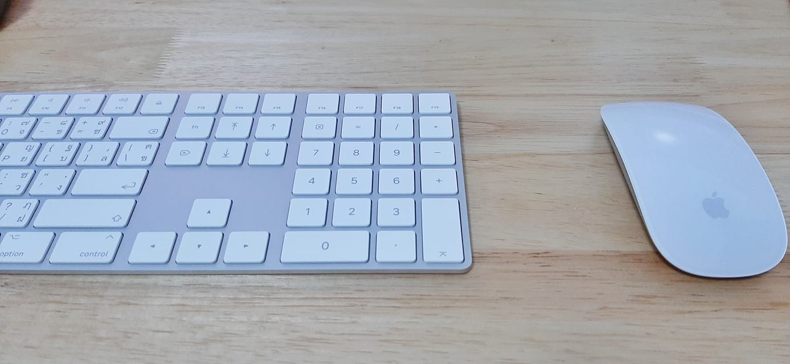

### Hi there 👋

👨‍💻 My name is Thiraphat Putson 
I'm a Full Stack Developer. 
This is my portfolio. 
🔭 I’m currently working on Home. 
🌱 I’m currently learning Things Every Programmer Should Know. 
😄 Hobbies : Gunpla, Game, Music, Programming, Gundam 
⚡ IDE that I like to use : Visual Studio Code 
⚡ OS : MacOs, Linux, Windows 

⚡ Codepen : [@thiraphat_ps_dev](https://codepen.io/thiraphat_ps_dev)
⚡ Facebook : [Thiraphat Putson](https://www.facebook.com/thiraphatputson)
⚡ Instagram : [gunzxy](https://www.instagram.com/gunzxy/)
⚡ Email : Thiraphat.ps.dev@gmail.com
<!--
**thiraphat-ps-dev/thiraphat-ps-dev** is a ✨ _special_ ✨ repository because its `README.md` (this file) appears on your GitHub profile.

Here are some ideas to get you started:

- 🔭 I’m currently working on ...
- 🌱 I’m currently learning ...
- 👯 I’m looking to collaborate on ...
- 🤔 I’m looking for help with ...
- 💬 Ask me about ...
- 📫 How to reach me: ...
- 😄 Pronouns: ...
- ⚡ Fun fact: ...
-->
